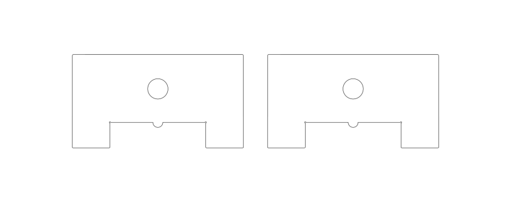

This is my first attempt at making a laser cut panel mount for Anderson Powerpole connectors commonly used in Amateur Radio.

These **must** be cut from a 2mm thick material such as acrylic plastic sheet.

These are currently a work in progress so your mileage may vary.

## Images

## Licence

This project is licensed under the [Creative Commons CC BY-NC-SA 4.0](https://creativecommons.org/licenses/by-nc-sa/4.0/) licence.

You are free to share and adapt the code as required, however you *must* give appropriate credit and indicate what changes have been made. You must also distribute your adaptation under the same license. Commercial use is prohibited.

## Acknowledgements

Thanks to the [London Hackspace](https://london.hackspace.org.uk/) for use of the Laser Cutter.

